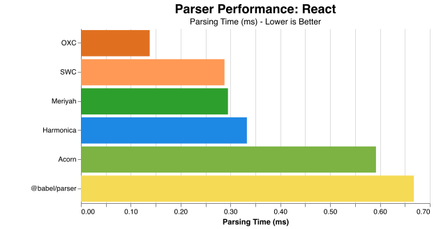
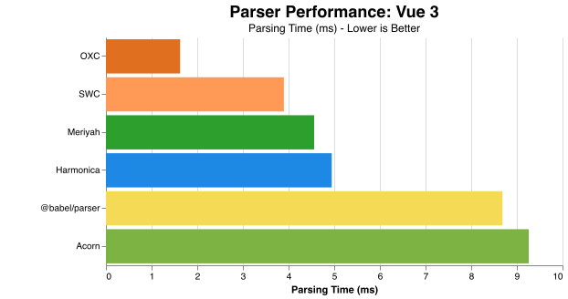
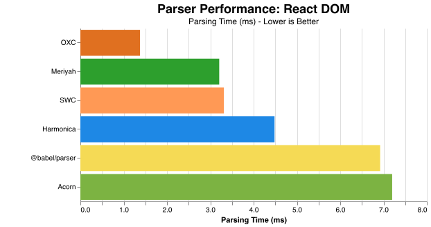
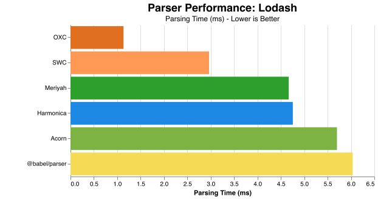
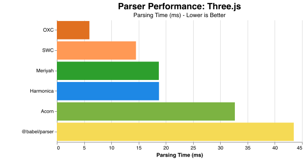
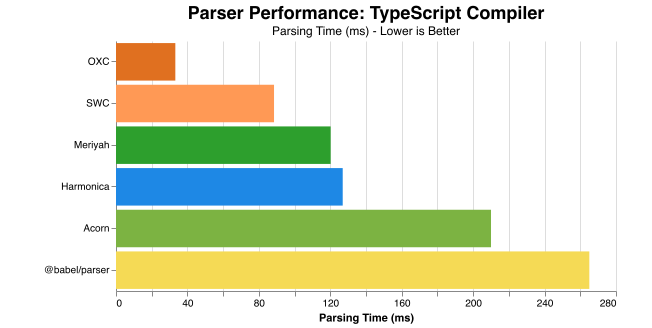

# Harmonica

A standards-compliant JavaScript parser written in Java. Produces ESTree-compatible ASTs validated against Acorn.

## Status

Work in progress.

## Features

- Full ES2024 support including modules, classes, async/await, and destructuring
- ESTree-compliant AST output
- Modern Java implementation using records, sealed interfaces, and pattern matching
- Validated against test262 and real-world JavaScript libraries

## Modules

Harmonica is split into three modules to minimize dependencies:

| Module | Description | Dependencies |
|--------|-------------|--------------|
| `harmonica-core` | Parser, lexer, and AST types | None |
| `harmonica-json-api` | JSON serialization interfaces | harmonica-core |
| `harmonica-jackson` | Jackson-based JSON implementation | harmonica-json-api, Jackson |

Use `harmonica-core` alone if you only need to parse JavaScript and work with the AST directly. Add `harmonica-jackson` if you need JSON serialization (e.g., for ESTree compatibility testing).

## Usage

### Parsing JavaScript

```java
import com.jsparser.Parser;
import com.jsparser.ast.Program;

String source = "const add = (a, b) => a + b;";
Program ast = Parser.parse(source);
```

### JSON Serialization (with Jackson)

Add `harmonica-jackson` to your dependencies, then use either the high-level API:

```java
import com.jsparser.json.AstJsonProvider;

// Provider is auto-discovered via ServiceLoader
AstJsonProvider provider = AstJsonProvider.getProvider();
String json = provider.getSerializer().serialize(program);
Program parsed = provider.getDeserializer().deserializeProgram(json);
```

Or use Jackson's ObjectMapper directly:

```java
import com.jsparser.jackson.HarmonicaJackson;
import com.fasterxml.jackson.databind.ObjectMapper;

ObjectMapper mapper = HarmonicaJackson.createObjectMapper();
String json = mapper.writeValueAsString(program);
Program parsed = mapper.readValue(json, Program.class);
```

## Building

Requires Java 21+.

```bash
./mvnw test
```

## Performance

Harmonica has not been optimized for speed, but it remains fairly competitive with existing JavaScript parsers.

Benchmarks compare parsing time across real-world JavaScript libraries against Rust parsers (OXC, SWC) and JavaScript parsers (Meriyah, Acorn, Babel).

### React (10.5 KB)


### Vue 3 (130 KB)


### React DOM (128.8 KB)


### Lodash (531.3 KB)


### Three.js (1.28 MB)


### TypeScript Compiler (8.8 MB)


## License

AGPL-3.0
